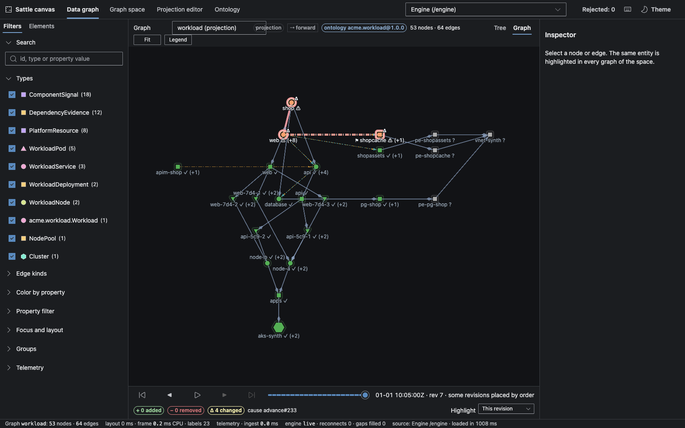
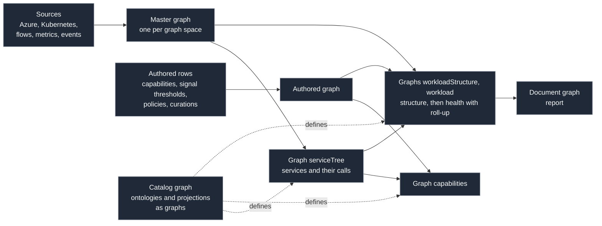
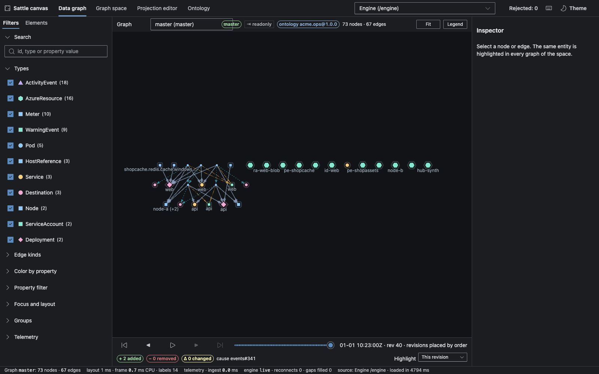
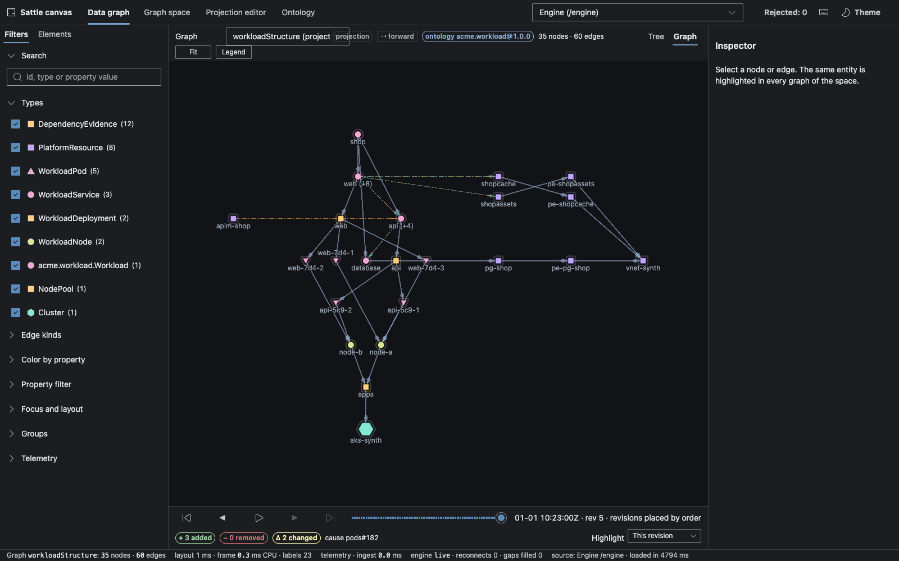
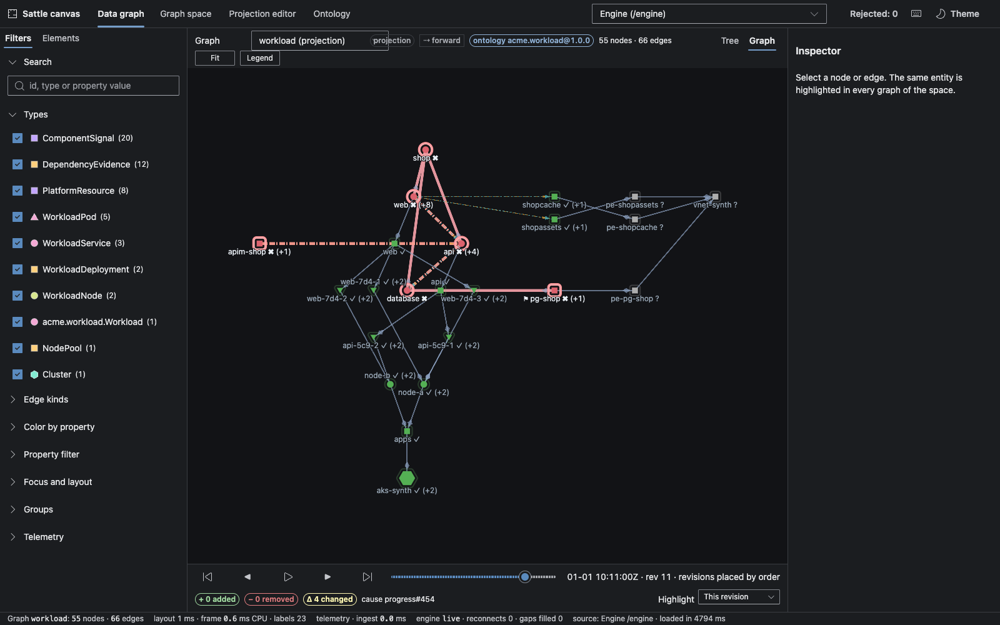
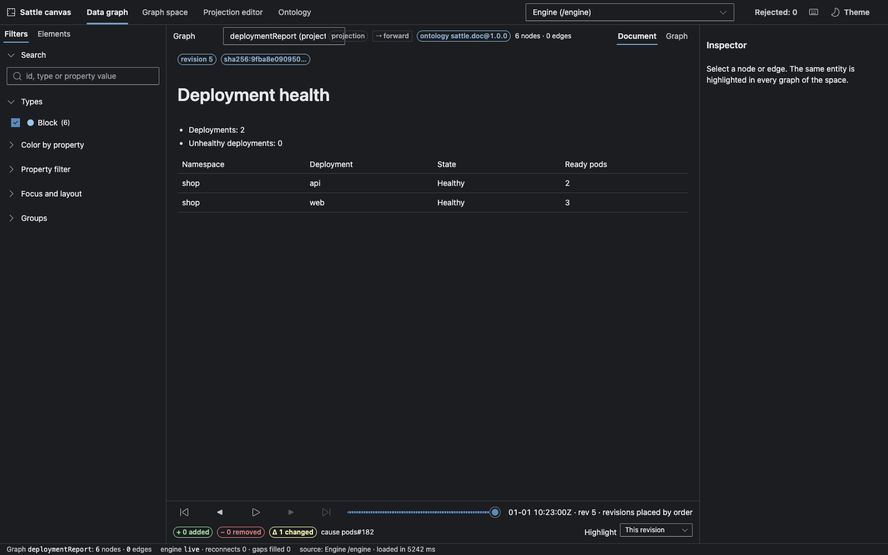
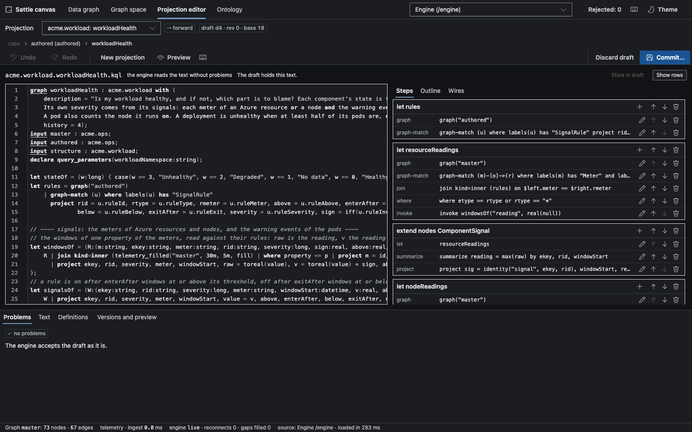
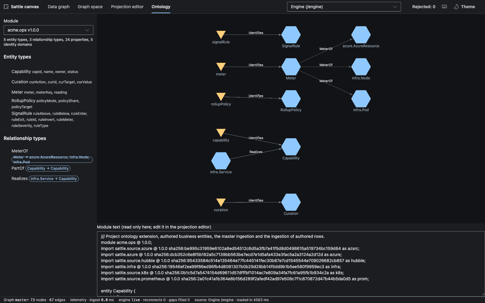

# Sattle

Sattle turns what a cloud system reports into graphs that explain it, and keeps them up to date.

- **Semi-structured data in.** Kubernetes objects, Azure resources and metrics, network flows, activity and audit events. Each record arrives in an envelope that names its source, and an adapter turns it into typed rows.
- **Domain knowledge added.** Ontology modules say which kinds of things exist, how they relate, and which key identifies each one, so the records of many sources about one thing become one entity.
- **Rules applied.** A projection is a KQL file of rules. It reads graphs and writes a new graph: services and their calls from pods, capabilities from services, a workload's health from its parts.
- **Graphs and trees out.** A graph space binds the projections into a set of graphs, from the master graph of everything reported up to a tree that names the part to blame.
- **Always up to date.** Each change of the input becomes a small patch to every graph it reaches. The same input gives the same graphs, whatever the batching.

This repository is research in progress. It holds a white paper, a working engine, a canvas to look at the graphs and edit their projections, and a lab that captured real Azure data. [Status](#status) says what is proven and what is not. The words are defined once in the [glossary](paper/glossary.md).


*The graph space on a synthetic estate. The master graph (top left) and the graphs the projections derive from it, each with its own nodes and edges.*

## Getting started

You need the [.NET 11 SDK](https://dotnet.microsoft.com/download/dotnet/11.0) and Node.js 22 or newer. Every step runs on the synthetic estate that ships with the repository, an invented Kubernetes and Azure workload with five failures on a 24 minute timeline. No cloud account is needed. Build once:

```bash
dotnet build engine/src/Sattle.Cli -c Release
```

```bash
npm --prefix canvas install
```

### 1. Start the engine

```bash
dotnet engine/src/Sattle.Cli/bin/Release/net11.0/sattle.dll serve engine/tests/Sattle.Tests/fixtures/estate --cluster synth --port 5080 --speed 20
```

- Wait for the line `serving http://127.0.0.1:5080`. From then on it replays the estate's records at 20 times their speed (the 24 minutes take about 72 seconds) and serves every graph as it changes.

### 2. Start the canvas

```bash
npm --prefix canvas run dev
```

### 3. Follow a failure down to its cause

- Open http://localhost:5173/#source=engine&view=data. The Data graph view shows one graph at a time; pick it in the "Graph" box.
- `master`: everything the sources reported, one entity per thing. `serviceTree`: the services and who calls whom, lifted from the calls between pods. `workloadStructure`: what the workload is made of and what each part depends on, with evidence. `workload`: its health.
- In `workload`, the graph follows the replay: the cache is overloaded at 10:05, the database server is down at 10:11, the storage account stops reporting at the end. Drag the timeline under the graph to any of them.



- Drag the timeline to 10:11 (revision 11) and open the Tree tab. It opens on the path to what is wrong: the database server `pg-shop` carries the origin mark, and every row above it says through which part it is affected.
- Click a row. The same entity is highlighted in every graph, and the Inspector shows it in the master and the other graphs and what it was derived from.

### 4. The other views

- http://localhost:5173/#view=space: the graph space, every graph side by side and which ones are built from which.
- http://localhost:5173/#view=ontology: the ontology modules, their types and relationships, drawn as the graph they are stored as.
- http://localhost:5173/#view=editor: the projection editor, a projection's KQL text with its steps, outline and wires.

### Read how a graph is defined

Projections are written in KQL, the query language of Azure Data Explorer and Log Analytics. Read them in this order:

1. [`acme.svc.serviceDeps.kql`](engine/definitions/acme.svc.serviceDeps.kql): calls between pods become dependencies between services (graph `serviceTree`).
2. [`acme.workload.workloadStructure.kql`](engine/definitions/acme.workload.workloadStructure.kql): what a workload is made of and what each part depends on, with evidence.
3. [`acme.workload.workloadHealth.kql`](engine/definitions/acme.workload.workloadHealth.kql): health from signals, rolled up to the workload (graph `workload`).

The space that binds them to graphs is [`acme.space.sattle`](engine/definitions/acme.space.sattle); the ontology they write is [`acme.workload.sattle`](engine/definitions/acme.workload.sattle).

### Change a projection and see the effect

```bash
dotnet engine/src/Sattle.Cli/bin/Release/net11.0/sattle.dll replay engine/tests/Sattle.Tests/fixtures/estate --cluster synth
```

- It prints the elements of each graph and a state digest.
- Change a rule in one of the `.kql` files and run it again. The counts and the digest show what changed. An error names the line in the `.kql` file.
- The Projection editor does the same on a running engine: it stores the text in a draft, checks it, previews the rows after each step, and commits.

### Learn why it works

- [paper/README.md](paper/README.md), then chapters [0](paper/ch00-introduction.md) (the problem), [3](paper/ch03-graphs-and-revisions.md) (graphs and revisions), [5](paper/ch05-projection-language.md) (projections) and [7](paper/ch07-telemetry-plane.md) (telemetry and health). The [glossary](paper/glossary.md) explains every term.
- [Research note 10](paper/research/10-existing-graph-languages.md): why projections are written in KQL.

### Run the tests

```bash
dotnet test engine/Sattle.slnx
```

```bash
dotnet test engine/tests/Sattle.Kql.Tests
```

```bash
npm --prefix canvas test
```

## Contents

- [Getting started](#getting-started)
- [The idea in one picture](#the-idea-in-one-picture)
- [Portfolio](#portfolio)
- [The white paper](#the-white-paper)
- [The engine](#the-engine)
- [The canvas](#the-canvas)
- [The lab](#the-lab)
- [Status](#status)
- [Earlier iteration](#earlier-iteration)

## The idea in one picture


```mermaid
flowchart LR
  S["Sources<br/>Azure, Kubernetes,<br/>flows, metrics, events"] --> M["Master graph<br/>one per graph space"]
  W["Authored rows<br/>capabilities, signal thresholds,<br/>policies, curations"] --> A["Authored graph"]
  M --> P1["Graph serviceTree<br/>services and their calls"]
  P1 --> P2["Graph capabilities"]
  A --> P2
  A --> H
  M --> H["Graphs workloadStructure, workload<br/>structure, then health with roll-up"]
  P1 --> H
  H --> D["Document graph<br/>report"]
  C["Catalog graph<br/>ontologies and projections<br/>as graphs"] -.defines.-> P1
  C -.defines.-> P2
  C -.defines.-> H
  classDef box fill:#1f2937,stroke:#9ca3af,color:#f9fafb;
  class S,W,M,A,P1,P2,H,D,C box;
```

- An edge between two lower-level nodes becomes an edge between their higher-level images. A projection writes that with joins, as in [`serviceDeps`](engine/definitions/acme.svc.serviceDeps.kql).
- Each arrow into a graph is a projection: a KQL file of rules. The dotted arrows: the projections and ontologies are themselves stored as graphs.
- Health is not built into the engine. It is an ontology module, [`acme.workload`](engine/definitions/acme.workload.sattle), and two projections, [`workloadStructure`](engine/definitions/acme.workload.workloadStructure.kql) and [`workloadHealth`](engine/definitions/acme.workload.workloadHealth.kql).

## Portfolio

All screenshots show the synthetic estate that ships with the repository ([generator](engine/tests/Sattle.Tests/fixtures/build-estate.py)). No real names appear in them.

### 1. The master graph



- Pods, services, deployments, nodes, Azure resources and evidence events in one graph, with a timeline of revisions.
- The adapters in [`Adapters.cs`](engine/src/Sattle.Runtime/Adapters.cs) turn envelopes into rows; the projection [`acme.ops.ingest.kql`](engine/definitions/acme.ops.ingest.kql) writes them into the graph under the ontology modules [`sattle.infra`](engine/definitions/sattle.infra.sattle) and [`sattle.azure`](engine/definitions/sattle.azure.sattle), whose identity domains make one entity of what several sources report about one thing.
- Theory: [Ch. 1, values and identity](paper/ch01-values-and-identity.md), [Ch. 3, graphs and revisions](paper/ch03-graphs-and-revisions.md).

### 2. A higher level: services


- Pod-to-pod calls lifted to service-to-service dependencies, with flows summed per pair.
- Definition: [`serviceDeps` of `acme.svc`](engine/definitions/acme.svc.serviceDeps.kql).
- Theory: edge lifting as a quotient in [Ch. 5](paper/ch05-projection-language.md).

### 3. One level higher: capabilities


- Service dependencies lifted again to the business capabilities the services realize.
- Definition: [`capabilityView` of `acme.biz`](engine/definitions/acme.biz.capabilityView.kql).

### 4. What a workload is made of and depends on



- The question it answers: what is my workload made of, what does it talk to, and what does each part depend on?
- Top to bottom: the workload, its services, their deployments and pods, the nodes, pool and cluster they run on. To the right: the cache, the storage account and the database server a service depends on, each reached through its private endpoint and the network. To the left: the gateway that exposes a service.
- Three kinds of edges, declared in the ontology module [`acme.workload`](engine/definitions/acme.workload.sattle) (`kind composition`, `kind dependency`, `kind communication`) and drawn differently.
- Every dependency is derived from data and carries its evidence: flows to a private endpoint's address, a resolved host name, a role of the pod's identity, an environment variable, calls between pods, a gateway backend. Definition: [`workloadStructure`](engine/definitions/acme.workload.workloadStructure.kql).

### 5. Its health, and which part is to blame



- The question it answers: is my workload healthy, and if not, which part is to blame?
- Here the database server is down. The path from the workload to the origin is drawn in red; the origin carries a flag. At another moment of the replay a crash-looping pod is a smaller origin: its deployment stays healthy because two of three pods are.
- A component's state is the worst severity over what it contains and what it depends on. Signals are meters read against authored signal thresholds; a meter that stops reporting becomes "no data", which is a state of its own. Definition: [`workloadHealth`](engine/definitions/acme.workload.workloadHealth.kql).
- Colors come from value roles declared in the ontology module (`roles { "Healthy": ok, ... }` on `Component.state`), not from code in the viewer.
- Theory: [Ch. 7, the telemetry plane](paper/ch07-telemetry-plane.md).


- The tree is the graph drawn by its hierarchy. It follows the relation the state was computed from. Each row says through which part it is unhealthy; the origin is marked.
- Code: [`tree-model.ts`](canvas/src/app/tree-model.ts), [`TreeView.tsx`](canvas/src/ui/TreeView.tsx).

### 6. A document is a graph too



- A report rendered from a graph of document blocks, with a digest per revision.
- Definition: [`deploymentReport`](engine/definitions/acme.report.deploymentReport.kql) into the ontology [`sattle.doc`](engine/definitions/sattle.doc.sattle). Renderer: [`Documents.cs`](engine/src/Sattle.Runtime/Documents.cs).
- A smaller health example with value roles: [`deploymentHealth`](engine/definitions/acme.deployhealth.deploymentHealth.kql).

### 7. Editing a projection



- A projection is edited as its KQL text, with three notations beside it (Steps, Outline, Wires) that change the same text and share one undo history.
- The text lives in a draft on the engine, which checks it, shows the rows after each step, and commits it as a new release of the module ([PROTOCOL.md](engine/PROTOCOL.md#checking-and-editing-definitions)).
- Code: [`EditorView.tsx`](canvas/src/ui/EditorView.tsx), [`KqlText.tsx`](canvas/src/ui/editor/KqlText.tsx), [`kql-edit.ts`](canvas/src/editor/kql-edit.ts).
- Tests that build deployment health, workload health and a threshold from an empty projection in each notation and compare the result with the original: [`kql-references.test.tsx`](canvas/tests/editors/kql-references.test.tsx).

### 8. Ontology modules are graphs



- The domain knowledge: types, relationships and their constraints, drawn as the graph they are stored as.
- Theory: [Ch. 2, ontologies as type graphs](paper/ch02-ontologies-as-type-graphs.md).

## The white paper

Start at [paper/README.md](paper/README.md). It states the research plan and what is closed.

| Chapter | Topic |
| --- | --- |
| [0](paper/ch00-introduction.md) | Introduction and research plan |
| [1](paper/ch01-values-and-identity.md) | Values and identity |
| [2](paper/ch02-ontologies-as-type-graphs.md) | Ontologies as type graphs |
| [3](paper/ch03-graphs-and-revisions.md) | Graphs and revisions |
| [4](paper/ch04-change-algebra.md) | Change algebra |
| [5](paper/ch05-projection-language.md) | The projection language |
| [6](paper/ch06-semantics-and-incrementality.md) | Semantics and incrementality |
| [7](paper/ch07-telemetry-plane.md) | The telemetry plane |
| [8](paper/ch08-sync-direction-and-bidirectional-consistency.md) | Direction and bidirectional consistency |
| [9](paper/ch09-evolution-evidence-provenance.md) | Evolution, evidence, provenance |
| [10](paper/ch10-sources-and-adapters.md) | Sources and adapters |
| [11](paper/ch11-storage-and-scale.md) | Storage and scale |
| [12](paper/ch12-outputs-documents-and-canvas.md) | Outputs: documents and canvas |
| [13](paper/ch13-performance.md) | Performance |
| [14](paper/ch14-evaluation.md) | Evaluation |
| [15](paper/ch15-related-work-and-limitations.md) | Related work and limitations |

- Reference pages: [glossary](paper/glossary.md), [notation](paper/notation.md), [references](paper/references.md).
- [Proof inventory](paper/inventory.md): every numbered statement with its status and what tests it.

Research notes behind the paper:

- [Storage and scale](paper/research/02-master-graph-storage-and-scale.md)
- [Projection language and meta-graph](paper/research/03-projection-language-and-metagraph.md)
- [Compute and memory efficiency, persistence, liveness](paper/research/04-compute-and-memory-efficiency.md): budgets per node and edge, a staged plan, experiments.
- [Expressiveness and flexibility](paper/research/05-expressiveness-and-flexibility.md): what the language can and cannot express, with a [capability suite](paper/research/05-suite).
- [Code review findings](paper/research/07-code-review-findings.md): an independent review of engine, tests, canvas and lab.

## The engine

.NET 11. Start at [engine/README.md](engine/README.md).

| Part | Where |
| --- | --- |
| Value algebra, compact graph, kernel table | [`Sattle.Core`](engine/src/Sattle.Core): [`Algebra.cs`](engine/src/Sattle.Core/Algebra.cs), [`Graph.cs`](engine/src/Sattle.Core/Graph.cs), [`Kernel.cs`](engine/src/Sattle.Core/Kernel.cs) |
| Language: parser, checker, lowering, printer | [`Sattle.Language`](engine/src/Sattle.Language): [`Syntax.cs`](engine/src/Sattle.Language/Syntax.cs), [`Checker.cs`](engine/src/Sattle.Language/Checker.cs), [`Lowering.cs`](engine/src/Sattle.Language/Lowering.cs), [`Printer.cs`](engine/src/Sattle.Language/Printer.cs) |
| Runtime: operators, output, identity, journal, drafts | [`Sattle.Runtime`](engine/src/Sattle.Runtime): [`Operators.cs`](engine/src/Sattle.Runtime/Operators.cs), [`Output.cs`](engine/src/Sattle.Runtime/Output.cs), [`Identity.cs`](engine/src/Sattle.Runtime/Identity.cs), [`Journal.cs`](engine/src/Sattle.Runtime/Journal.cs), [`Drafts.cs`](engine/src/Sattle.Runtime/Drafts.cs), [`LineageReader.cs`](engine/src/Sattle.Runtime/LineageReader.cs) |
| Command line and server | [`Sattle.Cli`](engine/src/Sattle.Cli): [`Program.cs`](engine/src/Sattle.Cli/Program.cs), [`Server.cs`](engine/src/Sattle.Cli/Server.cs) |
| Wire protocol | [PROTOCOL.md](engine/PROTOCOL.md): [reads](engine/PROTOCOL.md#reads), [telemetry](engine/PROTOCOL.md#telemetry), [lineage](engine/PROTOCOL.md#lineage), [editing definitions](engine/PROTOCOL.md#checking-and-editing-definitions) |
| Measurements | [PERF.md](engine/PERF.md) |

Definitions in [`engine/definitions`](engine/definitions), all plain text and all loaded as graphs:

- Ontology modules (`.sattle`): [`sattle.infra`](engine/definitions/sattle.infra.sattle), [`sattle.azure`](engine/definitions/sattle.azure.sattle), [`sattle.doc`](engine/definitions/sattle.doc.sattle), and one per example: [`acme.ops`](engine/definitions/acme.ops.sattle), [`acme.svc`](engine/definitions/acme.svc.sattle), [`acme.biz`](engine/definitions/acme.biz.sattle), [`acme.deployhealth`](engine/definitions/acme.deployhealth.sattle), [`acme.workload`](engine/definitions/acme.workload.sattle), [`acme.report`](engine/definitions/acme.report.sattle).
- Row types of the sources: [Kubernetes](engine/definitions/sattle.source.k8s.sattle), [Hubble flows](engine/definitions/sattle.source.hubble.sattle), [Prometheus](engine/definitions/sattle.source.prometheus.sattle), [Azure](engine/definitions/sattle.source.azure.sattle).
- Projections (`.kql`), one file each: [`ingest`](engine/definitions/acme.ops.ingest.kql) (the master) and [`authored`](engine/definitions/acme.ops.authored.kql), [`serviceDeps`](engine/definitions/acme.svc.serviceDeps.kql), [`capabilityView`](engine/definitions/acme.biz.capabilityView.kql), [`deploymentHealth`](engine/definitions/acme.deployhealth.deploymentHealth.kql), [`workloadStructure`](engine/definitions/acme.workload.workloadStructure.kql), [`workloadHealth`](engine/definitions/acme.workload.workloadHealth.kql), [`deploymentReport`](engine/definitions/acme.report.deploymentReport.kql), and the paused estate tree (`acme.tree*`).
- The graph space that binds them into 13 graphs: [`acme.space`](engine/definitions/acme.space.sattle).

How it is tested:

- An independent **reference evaluator** that computes every projection from scratch in the simplest possible way and shares no code with the runtime: [`Sattle.Reference`](engine/tests/Sattle.Reference) ([`ReferenceEvaluator.cs`](engine/tests/Sattle.Reference/ReferenceEvaluator.cs), [`ZSet.cs`](engine/tests/Sattle.Reference/ZSet.cs)).
- A **differential harness** that compares the engine's incremental result with the reference on generated inputs, under every batch split and reordering: [`Sattle.Differential`](engine/tests/Sattle.Differential) ([`Worlds.cs`](engine/tests/Sattle.Differential/Worlds.cs), [`Differential.cs`](engine/tests/Sattle.Differential/Differential.cs)).
- The main suite: [`Sattle.Tests`](engine/tests/Sattle.Tests).

## The canvas

React 19, Fluent UI v9, Zustand, WebGL. Start at [canvas/README.md](canvas/README.md).

- Graph core and rendering: [`core/graph.ts`](canvas/src/core/graph.ts), [`render/renderer.ts`](canvas/src/render/renderer.ts).
- State as actions and a reducer: [`state/reducer.ts`](canvas/src/state/reducer.ts).
- Graph sources: the live engine over one resumable event stream ([`source/engine.ts`](canvas/src/source/engine.ts)) and static files written by the engine ([`source/static.ts`](canvas/src/source/static.ts)).
- Views: Data graph (with the tabs Graph, [Tree](canvas/src/ui/TreeView.tsx) and [Document](canvas/src/ui/DocumentView.tsx)), Graph space, [Projection editor](canvas/src/ui/EditorView.tsx), Ontology.
- Color by declared value roles: [`color-by.ts`](canvas/src/app/color-by.ts).
- Accessibility checks in a real browser: [`a11y-cdp.mjs`](canvas/scripts/a11y-cdp.mjs).

## The lab

An `azd` project that added capture to an existing AKS cluster and removed it again. Start at [lab/README.md](lab/README.md).

- Infrastructure: [`azure.yaml`](lab/azure.yaml), [`main.bicep`](lab/infra/main.bicep).
- Capture format: [CAPTURE-FORMAT.md](lab/CAPTURE-FORMAT.md). Live forwarder to Event Hubs: [`eh-forward.mjs`](lab/capture/eh-forward.mjs).
- Captures and the fixtures derived from them are not in the repository. [`build.sh`](lab/fixtures/build.sh) builds scrubbed fixtures from a capture with [`scrub.mjs`](lab/fixtures/scrub.mjs).
- What the repository does carry is the synthetic estate, written by a [generator](engine/tests/Sattle.Tests/fixtures/build-estate.py). The canvas's default graph source and the public tests use it.

## Status

The work follows two phases. Phase 1 proves the theory, shows the language is flexible and expressive, and makes the engine efficient. Phase 2 is a health model on real Azure data that a person can read and that is always live.

What holds today:

- The engine's incremental result equals the independent reference evaluator in every generated case of the differential harness, under every batch split and reordering.
- The proof inventory has no statement left as a sketch or open. Some proofs rest on named premises about the engine, and most were checked by reading only.
- The language covers relational algebra with aggregation, graph patterns, bounded recursion, windows with thresholds, and edge lifting.
- A master graph of about 50,000 nodes was built from a real 17 minute capture of one cluster, and a health model with roll-up was derived from it.

What does not hold yet:

- **Efficiency.** The engine holds tens of kilobytes per master node. The target is about 1.6 KB at one million nodes on one machine. The plan is in [research note 04](paper/research/04-compute-and-memory-efficiency.md).
- **Expressiveness gaps.** Unbounded reachability, comparison of a window with an earlier one, and "no data for N windows" cannot be expressed. See [research note 05](paper/research/05-expressiveness-and-flexibility.md).
- **Always live.** Live input ran through Event Hubs only for the capture tooling, not yet for the engine's own reader ([#70](https://github.com/abossard/sattle/issues/70)). The source cluster runs again since 2026-11-16 ([`source-cluster.sh`](lab/source-cluster.sh)).
- **Persistence.** A local journal with snapshots works. A store-agnostic design that scales is a concept, not built.
- **Known defects** in the canvas and the lab from the [code review](paper/research/07-code-review-findings.md) are not all fixed.

## Earlier iteration

The first iteration was a design site with C# contracts and a test-only reference model. It is kept under [`brainstorm/`](brainstorm/README.md).

- [21-step animated guide](brainstorm/dist/index.html)
- [C# contracts and schemas](brainstorm/contracts)
- [Architecture](brainstorm/contracts/docs/ARCHITECTURE.md)
- Live site: https://health-graph-atlas-ab.ablazeblanket1.chatgpt.site
